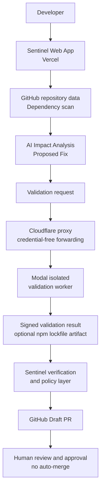
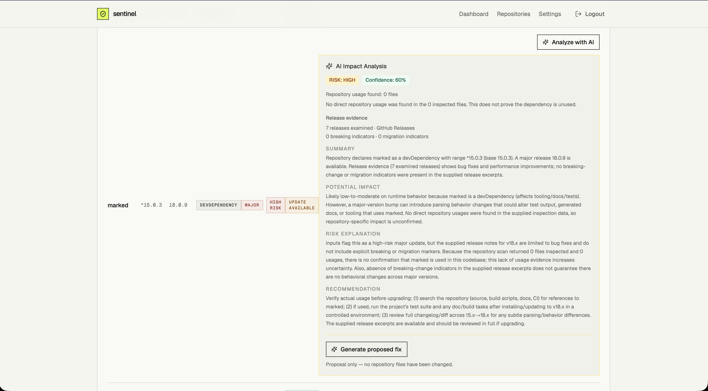
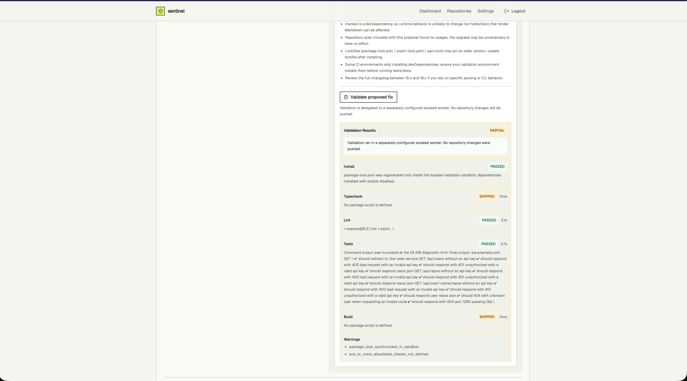
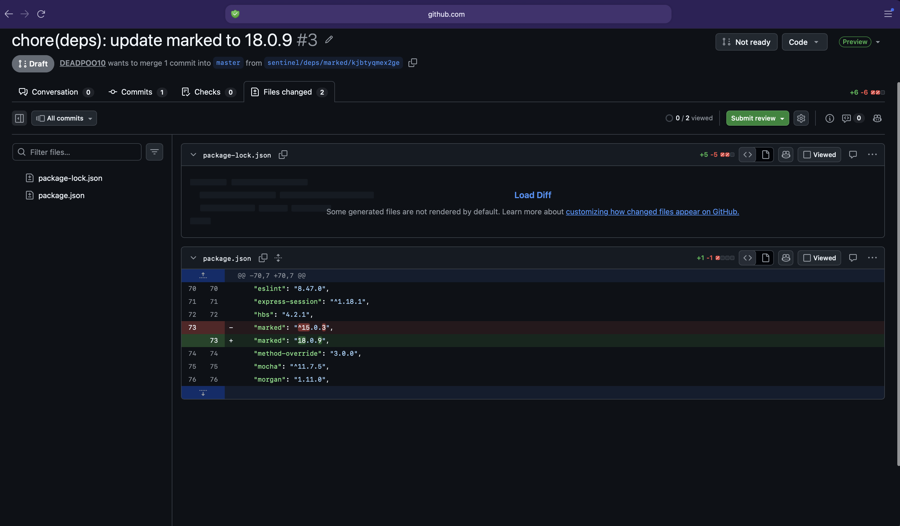

# Sentinel

## The AI maintenance engineer for dependency upgrades

Sentinel helps engineering teams keep JavaScript and TypeScript projects current without treating upgrades as blind version bumps. It discovers dependency changes, explains their likely impact in the context of a repository, prepares a focused upgrade, validates it in an isolated environment, and—only when a developer explicitly asks—opens a GitHub Draft Pull Request for review.

**Evidence first. Human review always.**

## What Sentinel does

- Connects to GitHub and surfaces repositories a signed-in developer can access.
- Scans npm dependencies and compares declared versions with available releases.
- Collects repository usage and release information to add context to an upgrade.
- Generates AI-assisted impact analysis and a focused proposed dependency change.
- Validates the proposed upgrade with install plus typecheck, lint, test, and build checks when the repository defines those scripts.
- Creates a GitHub **Draft** Pull Request only after validation and explicit user action.
- Records maintenance activity, analyses, proposed fixes, validation runs, and pull requests in PostgreSQL.

## The workflow

```text
Detect change → Understand repository impact → Prepare a focused upgrade
       → Validate in isolation → Open a Draft PR → Engineer reviews and decides
```

Sentinel is deliberately not an autopilot. It never writes to a repository's default branch, marks a pull request ready for review, or auto-merges a change.

## Architecture



Cloudflare forwards the validation request and does not execute customer code. Modal performs validation in isolation. Sentinel verifies the signed result and any returned lockfile artifact before its policy layer can permit a Draft PR; human approval remains mandatory.

## Draft PR safety model

Draft PR creation is opt-in and disabled unless `SENTINEL_PR_CREATION_ENABLED=true` is deliberately set. Before creating a branch, Sentinel requires a signed analysis/proposal/validation workflow and rechecks GitHub write access and the repository's current default-branch commit.

Version 1 authorizes one exact dependency-range change in `package.json`. For repositories with a root npm `package-lock.json`, Sentinel accepts it only when the same isolated validation run returned the corresponding authenticated, verified lockfile artifact. Sentinel verifies the artifact's exact byte length and SHA-256 digest before using it. Source-file edits and unsupported lockfile formats fail closed.

Eligible PRs are always created as drafts on deterministic `sentinel/deps/...` branches, protecting against duplicate requests while leaving final judgment to the reviewer.

## Validation architecture

The web application does not execute customer repository code in production. Validation runs in a separately deployed, short-lived worker with an ephemeral workspace, restricted network access, fixed command allowlists, resource limits, and signed request/response messages.

The included Modal worker validates immutable repository commits with:

- dependency installation with lifecycle scripts disabled;
- bounded typecheck, lint, test, and build commands when their scripts are available;
- registry-only network during install and no network during checks;
- HMAC-authenticated requests and signed results, including an optional npm lockfile artifact;
- cleanup of the workspace and package cache after every job.

Sentinel verifies the signed result before using it, then requires the returned job ID and immutable repository commit to match the validation it initiated. The optional root `package-lock.json` artifact is bounded, verified by byte length and SHA-256, and is never sent to the browser.

Read the full deployment and isolation requirements in [docs/VALIDATION_WORKER.md](docs/VALIDATION_WORKER.md).

## Demo: validated dependency upgrade

A controlled test upgraded `marked` from `^15.0.3` to `18.0.9`.

- Install: Passed
- Typecheck: Skipped
- Lint: Passed
- Tests: Passed
- Build: Skipped

The resulting GitHub Draft PR changed only `package.json` and `package-lock.json`. It required human review and was not auto-merged.

## Product walkthrough

### 1. AI impact analysis

Sentinel analyzes the proposed dependency upgrade using repository context and release evidence before proposing a change.



### 2. Isolated validation

The proposed fix is validated in an isolated worker. Sentinel reports executed, skipped, and failed checks explicitly.



### 3. GitHub Draft PR

After validation and policy checks, Sentinel can create a Draft PR for human review. Sentinel does not auto-merge.



## Stack

- Next.js, React, TypeScript, and Tailwind CSS
- Auth.js with GitHub OAuth
- Prisma and PostgreSQL/Neon
- OpenAI for user-triggered impact analysis and proposed fixes
- GitHub REST API for repository data and Draft PR creation
- Modal-based isolated validation worker, with an optional Cloudflare validation proxy

## Run locally

### Prerequisites

- Node.js 20+
- npm
- A PostgreSQL database
- A GitHub OAuth App
- An OpenAI API key for AI analysis features

Install dependencies and prepare Prisma:

```bash
npm install
npx prisma generate
npx prisma migrate dev
```

Create a local environment file with the required values:

```bash
AUTH_SECRET=
AUTH_GITHUB_ID=
AUTH_GITHUB_SECRET=
AUTH_URL=http://localhost:3000
DATABASE_URL=
OPENAI_API_KEY=
```

Start the application:

```bash
npm run dev
```

For local-only repository command validation, set `SENTINEL_VALIDATION_ENABLED=true`. Do not use this setting to enable production validation; production validation requires the isolated worker described above.

## Quality checks

```bash
npm run lint
npm test
npm run build
npx prisma validate
```

## Deployment notes

Set `AUTH_URL` to one canonical HTTPS origin, configure the matching GitHub OAuth callback at `/api/auth/callback/github`, and use a pooled Neon/PostgreSQL connection for `DATABASE_URL`. Apply production migrations with:

```bash
npx prisma migrate deploy
```

Keep both repository validation and Draft PR creation disabled until their respective production integrations have been independently configured and reviewed. The complete rollout checklist is in [docs/deployment-readiness.md](docs/deployment-readiness.md).

## Current scope

Sentinel currently focuses on npm dependency upgrades for JavaScript and TypeScript repositories. Draft PRs support `package.json` and, when verifiably generated by the validation worker, a root `package-lock.json`.

### Roadmap

pnpm, Yarn, Bun, and `npm-shrinkwrap.json` support are future work; those repositories are not eligible for automated Draft PR creation today.
